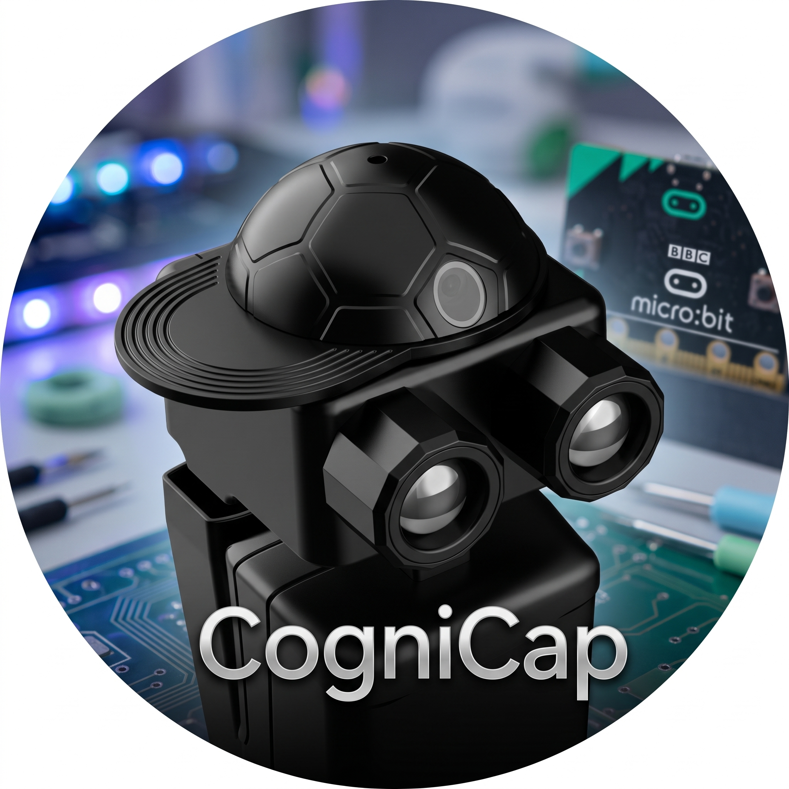

# CogniCap — the AI Cap for Robot PU



**Give your Robot PU sight, a voice, and a personality of its own.**

CogniCap is an ESP32-S3 AI camera + microphone add-on that snaps onto Robot PU's head. With this MakeCode extension, your robot can see faces, chase a soccer ball, obey voice commands, and learn a personality from how you play with it — all with drag-and-drop blocks.

**[Buy the Robot PU kit on Amazon →](https://www.amazon.com/Robot-Programmable-Interactive-Upgradable-Self-Balancing/dp/B0DR8RGVXN)** · **CogniCap: coming soon on Amazon** — [watch this repo](https://github.com/robotgyms/pxt-robotpu-cap) for launch updates

## What you can build

- **A robot that sees you** — face detection and head tracking keep PU's eyes on you ([face interaction](tutorials/face-interaction.md), [object tracking](tutorials/object-tracking.md))
- **A soccer striker** — find the ball, dribble, and kick at the goal ([ball following](tutorials/ball-following.md), [soccer game](tutorials/soccer-game.md))
- **A voice-controlled companion** — wake word plus 29 built-in voice commands ([voice command](tutorials/voice-command.md))
- **A robot with a personality** — a built-in Q-table learns which actions earn your attention ([personality Q-table](tutorials/personality-qtable.md))
- **And more** — walkie-talkie chat, object following, watch-sitting; see all [tutorials](tutorials/)

## A smarter PU — and a smarter anything

CogniCap runs all the AI on its own ESP32-S3, so the micro:bit stays free to drive the robot:

- **Eyes that see**: the OV5640 camera detects faces, balls, and goals on-device — no cloud, no app, no Wi-Fi. New objects plug into the same generic blocks.
- **Ears that listen**: WakeNet wake-word plus MultiNet command recognition give hands-free control — say "kick" and PU kicks.
- **A brain that learns**: the built-in Q-table turns your reactions into rewards, so PU develops a personality the more you play.
- **Instant upgrades**: head tracking, object following, and searching are single blocks — what would take pages of servo code is one `head track` or `follow` block.

### Not just for Robot PU

CogniCap mounts with a **standard LEGO-compatible adaptor**, so it snaps onto LEGO Technic beams and custom builds. And because it talks plain I2C, **any robot driven by a micro:bit V2** gets the same vision, voice, and learning blocks — clip it onto a LEGO rover, a classroom build, or your own creation and it gets the same eyes, ears, and learning brain.

## About Robot PU

[Robot PU](https://robotgyms.com/pu) is a programmable, self-balancing biped robot powered by the BBC micro:bit. It walks, dances, kicks, avoids obstacles on its own, and expresses itself through its glowing LED eyes.

- **[Buy the Robot PU kit on Amazon →](https://www.amazon.com/Robot-Programmable-Interactive-Upgradable-Self-Balancing/dp/B0DR8RGVXN)**
- Free learning content: [Manual](https://robotgyms.com/courses/the-story-of-pu-book-1-pair-up/) · [Tutorials](https://github.com/robotgyms/pxt-robotpu/tree/main/tutorials/README.md) · [Games](https://robotgyms.com/courses/the-story-of-pu-book-2-games/) · [Classes](https://robotgyms.com/courses/the-story-of-pu-book-3-growth) · [Upgrade projects](https://robotgyms.com/courses/the-story-of-pu-book-4-journey/)
- Watch it move: [YouTube](https://www.youtube.com/@TheStoryofPu-yw8tr) · [TikTok](https://www.tiktok.com/@thestoryofpu)

## What you need

- [Robot PU](https://www.amazon.com/Robot-Programmable-Interactive-Upgradable-Self-Balancing/dp/B0DR8RGVXN) with a **BBC micro:bit V2** (V1 is not supported)
- **CogniCap** smart hat (ESP32-S3, OV5640 camera, microphone, I2C hub) — *coming soon on Amazon*

## Get started in 3 steps

1. Snap CogniCap onto Robot PU and connect it to the I2C hub (see [CogniCap setup](tutorials/cognicap-setup.md)).
2. In [MakeCode for micro:bit](https://makecode.microbit.org/), open **Extensions** and paste `https://github.com/robotgyms/pxt-robotpu-cap`.
3. Add a `start CogniCap` block plus any tracking or voice block — flash, and PU sees the world.

## How it works

`pxt-robotpu-cap` is a MakeCode extension for the BBC micro:bit V2 that drives the **CogniCap** AI cap. It adds:

- **AI vision** (face, soccer ball, soccer goal detection, and any future objects through the same generic API)
- **Voice commands** through WakeNet wake-word and MultiNet command recognition
- **Reinforcement learning** Q-table code built into CogniCap; together with the micro:bit RL code, Robot PU develops its own personality after you interact with it for a while
- **High-level tracking and following** with generic `headTrackObject`, `followObject`, and `searchForObject` blocks

The micro:bit polls CogniCap over I2C for object locations and voice action tokens. High-level blocks then drive Robot PU through `pxt-robotpu-pro`. The extension only runs on micro:bit V2.

## Design highlights

- **Compact, scalable I2C protocol**: Message types are split into segments (`0x00-0x0F` status/device, `0x10-0x1F` voice/audio, `0x20-0xFF` vision/detection). One packet parser handles all current and future vision objects.
- **Generic object API**: `CapObject.Face`, `CapObject.Ball`, and `CapObject.Goal` are passed to the same `objectDetected`, `headTrackObject`, `followObject`, and `searchForObject` blocks. New objects can be added without adding new blocks.
- **Service enabling by message type**: `enableDetection` uses the message type as the service key and keeps a per-service status dictionary, so services are automatically restored after a camera reboot.
- **CogniCap class is independent of `robotPuPro`**: `class CogniCap` only handles I2C parsing and dispatch. Any `robotPuPro` calls live in separate high-level helper blocks, keeping the core driver clean and reusable.

## Blocks

Open MakeCode, add this extension, and look for the **CogniCap** category.

### Setup

- `start CogniCap` — power up the ESP32-S3 pipeline and start I2C packet polling.
- `stop CogniCap` — stop the background loops.
- `enable %object detection %enabled` — toggle a detection service by `CapObject`.
- `enable voice commands %enabled` — toggle voice command recognition.
- `print i2c packet` — print the last 18-byte packet to the serial console for debugging.

### I2C / Events

- `on i2c message type %type` — run code when a packet with the given type arrives.
- `on %object detected` — run code when the selected object is newly detected.
- `on wake word` — run code when the wake word is heard.
- `on voice command %action` — run code for a specific voice command token.
- `on any voice command` — run code for every recognised voice command; use `last voice command` inside.
- `last voice command` — the `VoiceAction` token from the latest `EVT_VOICE` packet.
- `last action token` — the action/count byte from the last `EVT_ACTION` or `EVT_VOICE` packet.

### Vision

- `%object detected` — returns `true` when the object is seen and fresh.
- `%object x (mm)` / `%object y (mm)` — ground-plane position from the camera.
- `%object width` / `%object height` — bounding box size in pixels.
- `%object yaw` / `%object pitch` — head angle to the object.
- `%object count` — detection count or score byte.

### Voice

- `on voice command %action` — run code when a specific command is recognised.
- `on any voice command` — run code when any command is recognised.
- `last voice command` — the token of the latest recognised command.
- `enable sentiment feedback %enabled` — listen for feedback words (`No`, `Bad`, `Okay`, `Good`, `Great`, `Excellent`).
- `latest voice command` — the recognised command string, when available.

The `VoiceAction` enum contains the words the ESP32-S3 can learn with MultiNet:
`rest`, `go`, `back`, `stop`, `jump`, `kick`, `sing`, `talk`, `dance`, `left`, `right`, `straight`, `wake up`, `walk`, `walk backward`, `turn left`, `turn right`, `explore`, `sit`, `stand`, `laugh`, `cry`, `scream`, `funny`, `blink`, `greet`, `drive`, `calibrate`, `duck`.

### Learning

- `reset Q-table` — clear the 64-state × 8-action table.
- `set Q reward state <state> action <action> reward <reward>` — store a reward.
- `Q value state <state> action <action>` — read a stored value.
- `best Q action for state <state>` — pick the action with the highest Q value.

### Attention

- `attention state` — current 3-bit state built from face, voice and sound spikes.
- `attention reward` — reward score from the recent face/voice/sound counters.
- `attention action` — update the Q-table with the last reward and return the best action for the current state.
- `set attention sound threshold <threshold>` — sound level over which a microphone sample counts as a spike.
- `set attention explore <percent>` — chance (0..100) of picking a random action for exploration.
- `reset attention counters` — clear the face/voice/sound counters.

### Tracking

- `head track %object pitch gain %pitchSpeedGain yaw gain %yawSpeedGain` — keep the head centred on the object.
- `follow %object distance %distance speed gain %speedGain turn gain %turnGain` — drive Robot PU toward the object while keeping the target distance.
- `search for %object` — scan the head to reacquire a lost object.

## Example: Face tracking

```typescript
robotPuCap.startCogniCap();

basic.forever(function () {
    robotPuCap.headTrackObject(robotPuCap.CapObject.Face, 0.2, 0.2);
    basic.pause(20);
});
```

## Example: Ball following

```typescript
robotPuCap.startCogniCap();

basic.forever(function () {
    robotPuCap.followObject(robotPuCap.CapObject.Ball, 150, 0.4, -0.2);
    basic.pause(5);
});
```

## Example: Robot soccer (simplified)

```typescript
robotPuCap.startCogniCap();

basic.forever(function () {
    let ballSeen = robotPuCap.objectDetected(robotPuCap.CapObject.Ball);
    let goalSeen = robotPuCap.objectDetected(robotPuCap.CapObject.Goal);
    if (ballSeen && goalSeen) {
        robotPuCap.followObject(robotPuCap.CapObject.Ball, 150, 0.4, -0.2);
        if (robotPuCap.objectY(robotPuCap.CapObject.Ball) < 200) {
            let goalYaw = Math.atan2(
                robotPuCap.objectX(robotPuCap.CapObject.Goal),
                robotPuCap.objectY(robotPuCap.CapObject.Goal)
            ) * 57.3;
            robotPuPro.walk(1, goalYaw * -0.02);
            if (Math.abs(goalYaw) < 15) robotPuPro.kick();
        }
    } else if (ballSeen) {
        robotPuCap.followObject(robotPuCap.CapObject.Ball, 150, 0.4, -0.2);
    } else {
        robotPuCap.searchForObject(robotPuCap.CapObject.Ball);
        robotPuPro.walk(0, 1);
    }
    basic.pause(20);
});
```

## Example: Attention attractor

The robot watches for faces, voice commands and sound spikes. Each time `attention action` is called it rewards the previous action for the attention it received, then chooses the best action for the current 3-bit state. Over time it learns which `QAction` attracts the most attention.

```typescript
robotPuCap.startCogniCap();
robotPuCap.resetQTable();

function doAttractAction(action: number) {
    if (action == robotPuCap.QAction.Dance) {
        robotPuPro.start(robotPuPro.Action.Dance, 0);
    } else if (action == robotPuCap.QAction.Walk) {
        robotPuPro.walk(2, 0);
    } else if (action == robotPuCap.QAction.TurnLeft) {
        robotPuPro.walk(0, 1);
    } else if (action == robotPuCap.QAction.TurnRight) {
        robotPuPro.walk(0, -1);
    } else if (action == robotPuCap.QAction.Kick) {
        robotPuPro.kick();
    } else if (action == robotPuCap.QAction.Search) {
        robotPuCap.searchForObject(robotPuCap.CapObject.Ball);
    } else if (action == robotPuCap.QAction.Approach) {
        robotPuPro.walk(2, 0);
    } else {
        robotPuPro.start(robotPuPro.Action.Rest, 0);
    }
}

basic.forever(function () {
    let action = robotPuCap.attentionAction();
    doAttractAction(action);
    basic.pause(500);
});
```

## Dependencies

This extension depends on `pxt-robotpu-pro`. Update the GitHub reference in `pxt.json` if your fork or tag differs.

## For developers: how to release

Before release, review everything against the BBC MakeCode extension approval requirements.

All version numbers must start with a `v`, for example `v1.0.42`:

```
make release VERSION="v0.0.2"
```

## License

MIT
